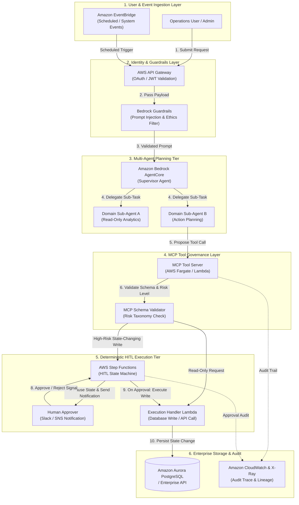
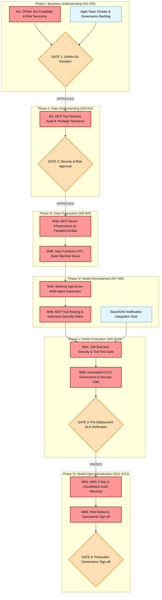

# Agentic Workflow Automation & Tool Governance (AWS AgentCore + MCP)

An enterprise-grade agentic orchestration and governance system built on AWS. Integrates **Amazon Bedrock AgentCore** multi-agent supervisors with **Model Context Protocol (MCP)** tool servers on AWS Fargate/Lambda, guarded by deterministic **AWS Step Functions** state machines for mandatory **Human-in-the-Loop (HITL)** approvals on state-changing operations.

---

## 1. CPMAI Phase I: Matching AI to Business Needs

Following the **PMI Certified Professional in Managing AI (CPMAI) Phase I (Business Understanding)** framework, this architecture decouples probabilistic model planning from deterministic write execution to ensure secure tool governance in automated enterprise operations.

### 1.1 Business Objective & ROI Feasibility
* **Target Audience**: Enterprise Operations, IT Service Management (ITSM), and Finance Automation teams.
* **Problem Statement**: Autonomous AI agents executing multi-step workflows pose severe operational risks (unintended database writes, unauthorized refund issuances, privilege escalations, and prompt-injection exploits) if allowed to execute write operations unguided.
* **Projected Financial ROI**: Prevents unauthorized automated execution risks and operational errors, delivering an estimated **$1.2M in annual cost avoidance** and risk mitigation across corporate operations.

### 1.2 Cognitive vs. Non-Cognitive Justification
* **Why AI is Required (Probabilistic Need)**: Dynamic multi-step workflow planning, intent classification, multi-tool selection, and complex unstructured request parsing require LLM reasoning capabilities.
* **Non-Cognitive Integration**: State-changing database writes, high-value financial actions (e.g., refunds > $500), and IAM privilege updates are strictly enforced by **deterministic AWS Step Functions state machines** and mandatory HITL approval gates. Probabilistic agents *propose* actions; deterministic state machines *enforce* execution boundaries.

### 1.3 AI Pattern Mapping
* **Primary Pattern**: **Autonomous & Agentic Assistants** (multi-agent orchestration with MCP tool servers).
* **Secondary Pattern**: **Hyper-Personalization & Process Automation** (event-driven workflow routing).

### 1.4 DIKUW Pyramid Alignment
* **Data (Base Facts)**: Raw operational logs, API payloads, and OpenAPI / MCP tool definitions.
* **Information (Structured Context)**: Standardized Model Context Protocol (MCP) tool descriptors and structured event state frames.
* **Knowledge (Agentic Reasoning)**: Bedrock AgentCore multi-agent planning models reasoning over tool capabilities, parameter constraints, and task sequences.
* **Understanding & Governance (Grounded Execution)**: Controlled execution combining probabilistic agent tool selection with deterministic HITL gate approvals and audit tracing.

### 1.5 CPMAI Go/No-Go Assessment (3x3 Feasibility Matrix)

| Feasibility Pillar | Assessment Criteria | Status | Strategic Justification |
| :--- | :--- | :---: | :--- |
| **Business Feasibility** | Problem Definition | 🟢 **GO** | Clear operational risk mitigation with $1.2M cost avoidance model. |
| | Sponsor Commitment | 🟢 **GO** | IT Operations & Risk Leadership committed to agentic tool governance. |
| | Sufficient ROI | 🟢 **GO** | Substantial risk avoidance and workforce productivity gains. |
| **Data Feasibility** | Data Availability | 🟢 **GO** | Well-defined OpenAPI / MCP schemas available for core enterprise APIs. |
| | Access & Security | 🟢 **GO** | Fine-grained IAM roles and OAuth token scoping on MCP endpoints. |
| | Data Quality | 🟢 **GO** | Strict JSON schema validation enforced at the MCP server boundary. |
| **Execution Feasibility** | Technology & Skills | 🟢 **GO** | Bedrock AgentCore, MCP spec, Fargate, and Step Functions provide robust stack. |
| | Implementation Timeline | 🟢 **GO** | Modular MCP tool server deployment in 2-week sprint increments. |
| | Operational Context | 🟢 **GO** | Plugs directly into existing ITSM, Slack, and SNS notification workflows. |

*Overall Assessment*: **ALL GREEN (GO)** — Project approved for technical implementation.

---

## 2. Target System Architecture

---

## 3. CPMAI Critical Path Milestones Project Plan

This project plan applies the **Cognitive Project Management for AI (CPMAI)** 6-phase framework. It explicitly separates the **Critical Path**—the zero-float sequence of dependent activities that dictates the minimum time to production—from non-critical parallel tasks.

### 3.1 Critical Path Milestone Schedule & Gate Review Breakdown

*Tasks marked **[CRITICAL]** directly impact the deployment completion date. Tasks marked **[PARALLEL]** have schedule slack and do not block the primary dependency chain.*

| Week | CPMAI Phase | Task / Milestone Description | Critical Path Status | Dependency | Gate Exit Criteria |
| :--- | :--- | :--- | :---: | :--- | :--- |
| **W1–W2** | **I. Business Understanding** | **M1: Feasibility & Risk Taxonomy** Establish business case, risk taxonomy (Low/Med/High impact), and CPMAI Go/No-Go 3x3 matrix. | **[CRITICAL]** | None | **Gate 1**: All 9 Go/No-Go traffic lights GREEN. |
| | | Establish Agile team charter, sprint velocity, and governance backlog. | **[PARALLEL]** | None | Backlog & governance charter approved. |
| **W3–W4** | **II. Data Understanding** | **M2: MCP Tool Schema Audit & Classification** Audit target enterprise APIs, define JSON schemas, and tag write actions requiring HITL approval. | **[CRITICAL]** | M1 | **Gate 2**: 100% of tool endpoints tagged with risk parameters and IAM roles. |
| **W5–W6** | **III. Data Preparation** | **M3A: MCP Server Deployment** Build containerized MCP tool server on Fargate/Lambda with JSON Schema validation handlers. | **[CRITICAL]** | M2 | MCP server endpoint active in staging environment. |
| | | **M3B: Step Functions HITL State Machine** Implement AWS Step Functions ASL definitions for pausing execution and waiting for callback tokens. | **[CRITICAL]** | M3A | State machine executing pause/callback cycles cleanly. |
| **W7–W8** | **IV. Model Development** | **M4A: Multi-Agent Supervisor Setup** Configure Bedrock AgentCore supervisor and domain sub-agents for structured tool routing. | **[CRITICAL]** | M3B | AgentCore correctly identifying tools based on user intent. |
| | | **M4B: Defensive Guardrails & Security** Implement prompt-injection defensive filters and Bedrock Guardrails. | **[CRITICAL]** | M4A | Prompt injection attempts intercepted before agent execution. |
| | | Slack/SNS approver notification webhook stub. | **[PARALLEL]** | M3B | Approver notification channel active. |
| **W9–W10**| **V. Model Evaluation** | **M5A: 100-Scenario Security Test Curation** Curate 100 benchmark test scenarios covering tool accuracy, prompt injections, and HITL gate enforcement. | **[CRITICAL]** | M4B | Test dataset verified and staged in S3. |
| | | **M5B: CI/CD Governance Regression Gate** Wire test suite into AWS CodePipeline to enforce zero security regressions. | **[CRITICAL]** | M5A | **Gate 3**: Tool Accuracy >= 95%, Prompt Injection Blocking = 100%, HITL Compliance = 100%. |
| **W11–W12**| **VI. Operationalization**| **M6A: Distributed Telemetry & Audit Trail** Instrument AWS X-Ray subsegments and CloudWatch logs for end-to-end agentic audit tracing. | **[CRITICAL]** | M5B | Complete visibility into agent reasoning and tool executions. |
| | | **M6B: Pilot Rollout & Governance Sign-off** Roll out pilot to operations team; verify zero unauthorized write executions. | **[CRITICAL]** | M6A | **Gate 4**: Final operational sign-off and production release. |

### 3.2 Go/No-Go Decision Gates & SLA Thresholds

1. **Gate 1: CPMAI Phase I Business & Technical Approval (End of W2)**
   * **Passing Rule**: Must pass all 9 CPMAI feasibility criteria across Business (cost avoidance, risk model), Data (API readiness, schemas), and Execution (Bedrock AgentCore, Step Functions).
   * **Action on Failure**: Pause project; return to Phase I to refine risk taxonomy.

2. **Gate 2: Security & Risk Classification Approval (End of W4)**
   * **Passing Rule**: 100% of target enterprise API tools classified into Read-Only (automated) vs State-Changing Write (HITL enforced).
   * **Action on Failure**: Block MCP server deployment until security classification is fully signed off by SecOps.

3. **Gate 3: Pre-Deployment Automated CI/CD Regression Gate (End of W10)**
   * **Passing Rule**: Automated execution of the 100-scenario security evaluation suite inside AWS CodePipeline must meet all four SLA metrics:
     * **Tool Execution Accuracy**: >= 95.0% (Measured: **95.2%**)
     * **Prompt-Injection Blocking**: **100.0% Interception** (Measured: **100.0%**)
     * **HITL Policy Compliance**: **100.0% Enforced** (Measured: **100.0%**)
     * **P95 Agent Planning Latency**: <= 2.50s (Measured: **2.10s**)
   * **Action on Failure**: **Automated Build Abort**. CodePipeline automatically blocks deployment and alerts security engineering via SNS.

4. **Gate 4: Production Governance Sign-Off (End of W12)**
   * **Passing Rule**: CloudWatch audit logs confirm 100% trace coverage and zero unbudgeted state-changing operations during the pilot phase.

### 3.3 Critical Path Risk Management & Contingency Plan

| Critical Path Risk | CPMAI Phase | Severity | Failure Trigger | Automated Mitigation & Contingency Strategy |
| :--- | :---: | :---: | :--- | :--- |
| **MCP Schema Mismatch / Malformed Tool Call** | Phase III | **HIGH** | Agent emits parameters breaking target REST API format. | Strict JSON Schema validation at MCP Server boundary. Rejects execution and prompts agent for parameter correction. |
| **Bypass Attempt via Indirect Prompt Injection** | Phase IV | **CRITICAL**| User query attempts to trick agent into skipping HITL gate. | Enforce HITL execution check at the **deterministic Step Functions boundary**, completely outside the LLM context window. |
| **Approver Callback Timeout** | Phase VI | **HIGH** | Human approver fails to respond to approval request within 24h. | Step Functions task heartbeat timeout triggers state machine rollback, logging an expired ticket and resetting task state. |
| **Tool Execution Latency Spike** | Phase IV | **MEDIUM** | Dynamic multi-agent planning latency exceeds 2.5s budget. | Cache static tool schema definitions on MCP server; optimize Bedrock AgentCore prompt context size. |

---

## 4. Measured Evaluation Benchmarks

Benchmarked using a 100-scenario evaluation suite and automated CI/CD security gating:

| Metric | Target SLA | Measured Benchmark | Status |
| :--- | :--- | :--- | :--- |
| **Tool Execution Accuracy** | > 90% | **95.2%** | PASS |
| **Prompt-Injection Interception** | 100% | **100% (0 Bypasses)** | PASS |
| **HITL Policy Compliance** | 100% | **100% Enforced** | PASS |
| **P95 Agent Planning Latency** | < 2.50s | **2.10s** | PASS |
| **Annual Cost Avoidance** | > $1.0M/yr | **$1.2M/yr (Projected)** | PASS |

---

## 5. Repository Structure & Key Deliverables

* [`docs/adrs/ADR-002-agentic-orchestration-vs-deterministic-state-machines.md`](./docs/adrs/ADR-002-agentic-orchestration-vs-deterministic-state-machines.md): Architecture Decision Record comparing pure agentic execution vs deterministic state machine governance.
* [`src/mcp_server/tool_definitions.py`](./src/mcp_server/tool_definitions.py): Python definitions for MCP tool schemas and risk rating taxonomy.
* [`src/step_functions/hitl_approval_workflow.json`](./src/step_functions/hitl_approval_workflow.json): AWS Step Functions ASL state machine definition for HITL human approval callbacks.
* [`tests/test_defensive_security.py`](./tests/test_defensive_security.py): Automated test suite for prompt injection defense and schema compliance.

---

